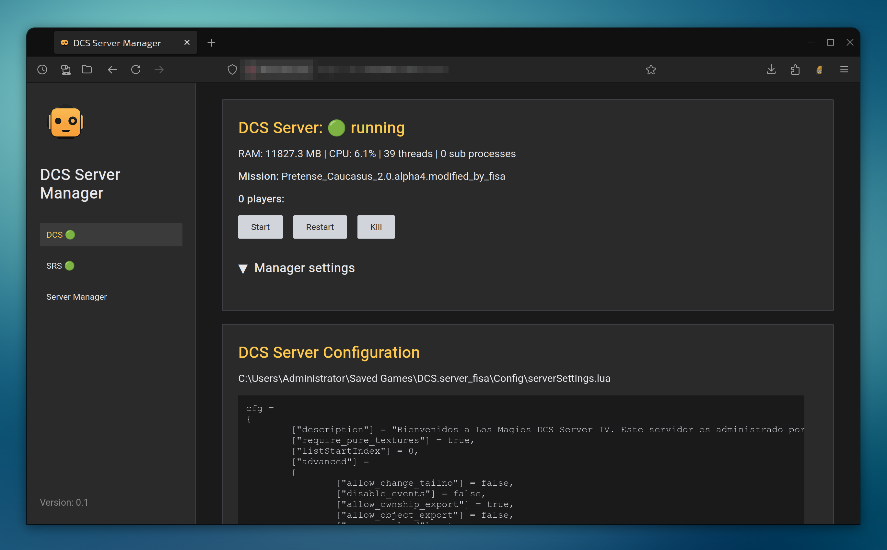
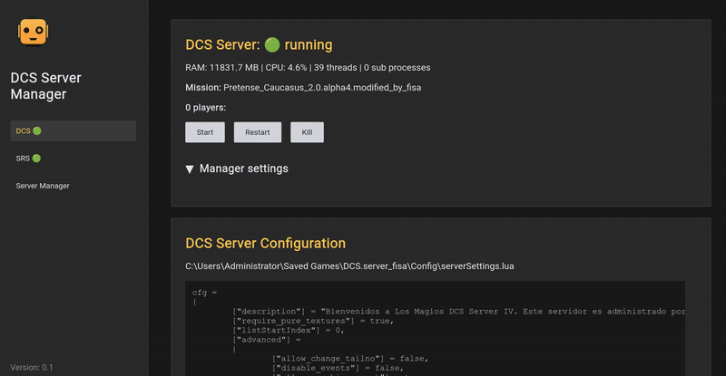

# DSM: DCS Server Manager

A super easy to use DCS and SRS server manager: simpler web UI, easily change missions, restart, 
monitor status, download tracks, etc.

It can even run in the background and automatically restart your DCS and SRS servers when 
they crash.

The main features are:

- 🚦 **Start/stop/restart DCS and SRS** servers from the UI.
- 🔎 **Check the current status** of the servers, plus CPU and RAM usage, mission and connected players.
- 📃 **Edit and apply DCS and SRS server configs** (change passwords, missions, etc).
- 🚑 **Automatic health checks**: ensure the servers are always up, auto-restart them when they 
  crash.
- 🔁 **Automatic daily reboots** of the DCS server, for missions that require it.
- 📁 **Manage misison, track and tacview files**: list them, download them, upload new 
  missions, delete old tracks, etc.
- 📈 **Historic logs** of your servers health and stats. See how the CPU, RAM, players, etc evolve 
  over time.

Plus a few other goodies.

# Installation

Just download the latest [released dsm.exe](https://github.com/fisadev/dcs_server_manager/releases)
and run it in your server (source code also available if you are paranoid about running random exes).

Then connect to it via a web browser using the URL displayed in the console (default is 
[http://localhost:9999](http://localhost:9999)), and configure the rest of DSM from the web UI 
itself.

The two config sections you surely want to set up are the DCS server and SRS server settings
(including the installation of the DCS hook, which can be done with just a button):

Every setting has a helpful tooltip if you have any doubts, and there's also the full
[User Manual](https://github.com/fisadev/dcs_server_manager/blob/main/docs/user_manual.md).

# Usage

Once the servers are configured you just need to make sure you run `dsm.exe` every time you boot 
your server machine. The easiest way is to add a scheduled task in Windows.

Everything else is done from the web UI. More info in the 
[User Manual](https://github.com/fisadev/dcs_server_manager/blob/main/docs/user_manual.md).

# Security

The web UI can be protected by a password (configured in the global settings section), but the 
connection is not encrypted. Usually it's best to only allow access to DSM's web UI only from 
within your local network (so, no port forwarding in your router from the outside world to your 
DSM web UI).

If you do want to connect from the outside world, please use a VPN (or if you have sysadmin skills,
you can also setup a reverse proxy with SSL, like Nginx).

If you don't trust the released exe (very reasonable) but you have some technical skills, you can 
instead clone this repo and run the server from the source too. More info on that in the 
[development docs](https://github.com/fisadev/dcs_server_manager/blob/main/docs/development.md).
It's quite easy to build your own exe too.

# Developers

If you want to help develop this tool, take a look at the 
[development docs](https://github.com/fisadev/dcs_server_manager/blob/main/docs/development.md).
They explain how to clone and run this repo, build the exe, and more.

# License

This tool is completely free, and released under MIT license. You can do whatever you want with it, 
as long as you include the original license with it if you re-distribute it.
